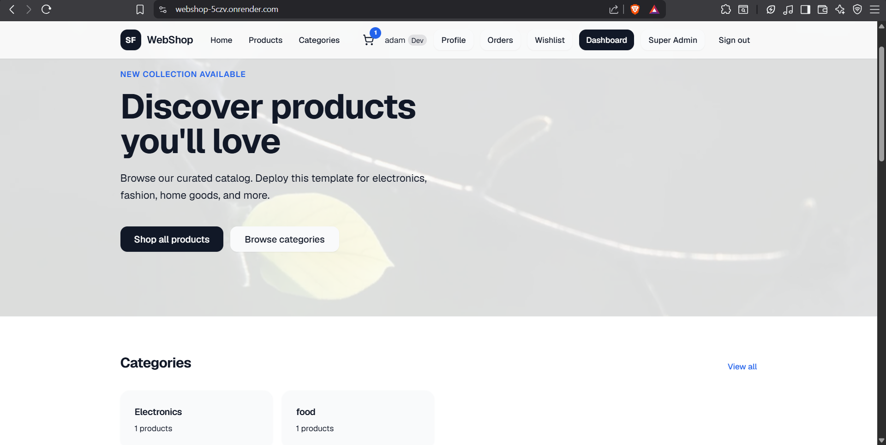
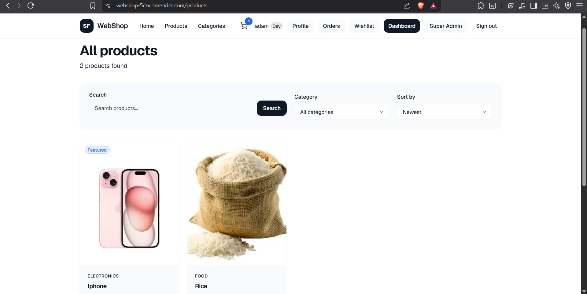
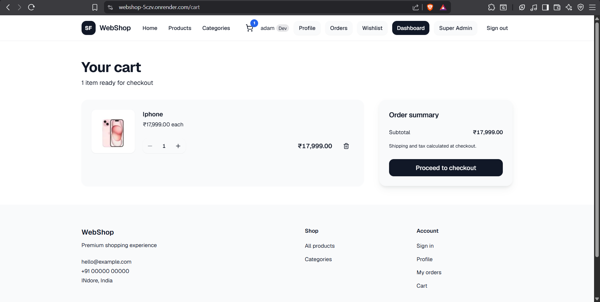
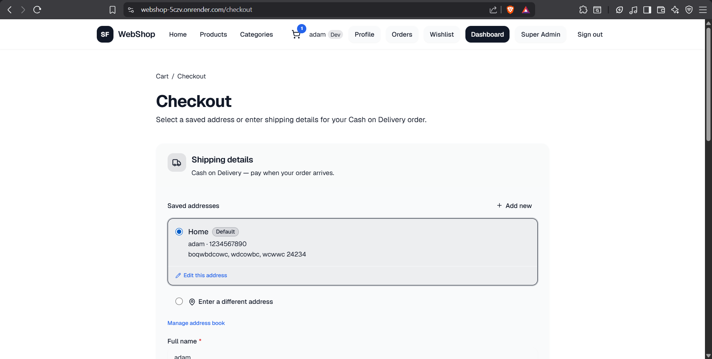
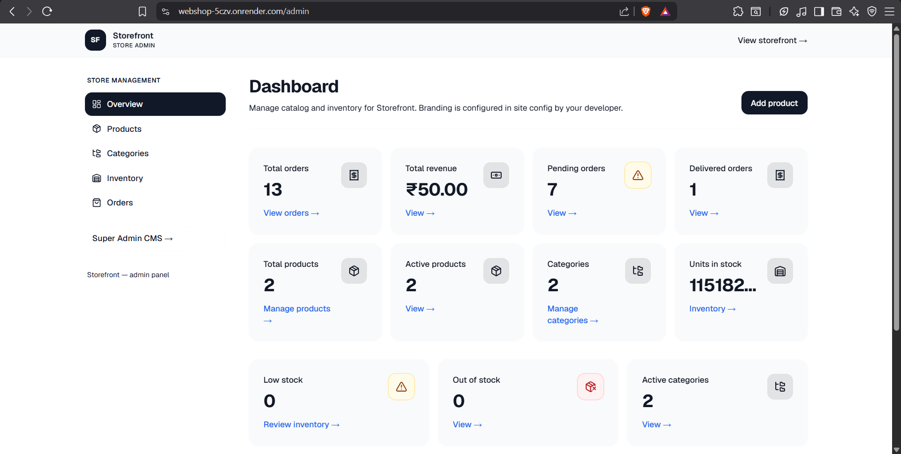
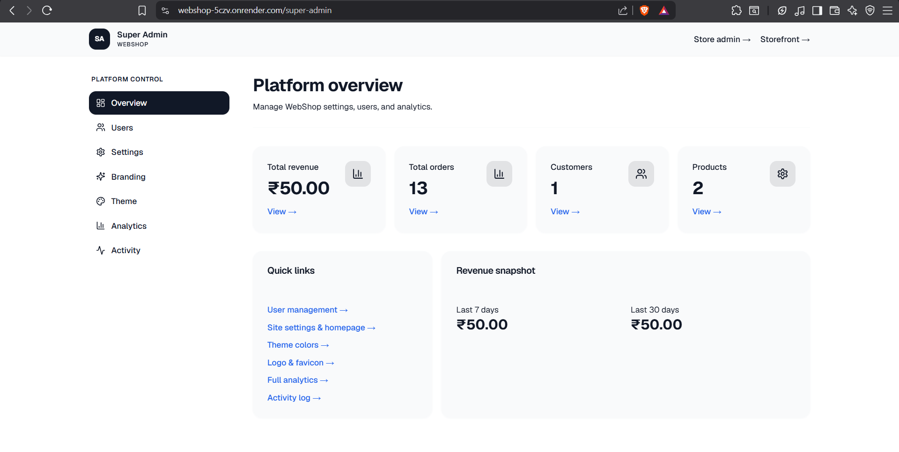

# 🛒 WebShop - Full Stack E-Commerce Platform

A production-ready full-stack e-commerce platform built with Next.js, TypeScript, Prisma, PostgreSQL, Clerk Authentication, and Tailwind CSS.

Designed with a complete customer, admin, and super-admin ecosystem including analytics, activity logs, inventory management, branding CMS, theme management, and performance optimizations.

---

## 🚀 Live Demo

**Website: https://webshop-5czv.onrender.com**

**GitHub Repository: https://github.com/harsh-dsk/WebShop**

---

# ✨ Features

## 👤 Customer Features

- User Authentication (Clerk)
- Product Browsing
- Product Search
- Category Filtering
- Wishlist Management
- Shopping Cart
- Address Book
- Checkout System
- Order Tracking
- Order History
- Recently Viewed Products
- Responsive Design

---

## 🛍️ E-Commerce Features

- Product Catalog
- Category Management
- Inventory Tracking
- Stock Management
- Dynamic Product Pages
- Product Images
- Order Processing
- Order Status Updates

---

## 🧑‍💼 Admin Dashboard

- Product Management
- Category Management
- Inventory Management
- Order Management
- Order Status Updates
- Sales Analytics
- Dashboard Metrics

---

## 👑 Super Admin Panel

- User Management
- Promote/Demote Admins
- Block/Unblock Users
- Site Settings Management
- Theme Management
- Branding Management
- Activity Logs
- Analytics Dashboard

---

## 🎨 Dynamic CMS System

Super Admin can manage:

- Store Name
- Store Branding
- Store Logo
- Theme Colors
- Homepage Content
- Site Settings

without changing code.

---

## 📊 Analytics & Monitoring

- Sales Analytics
- Inventory Analytics
- User Activity Logs
- Dashboard Insights
- Performance Optimizations

---

## ⚡ Performance Optimizations

- Next.js App Router
- Server Components
- Prisma Query Optimization
- Database Caching
- React Cache
- Route Loading States
- Skeleton Loaders
- Optimistic UI Updates
- Image Optimization
- Bundle Optimization

---

## 🔒 Security Features

- Clerk Authentication
- Role-Based Access Control
- Rate Limiting
- Protected Routes
- Admin Authorization
- Super Admin Authorization
- Security Headers
- Form Validation
- API Protection

---

## 🌐 SEO Features

- Dynamic Metadata
- OpenGraph Support
- Twitter Cards
- Sitemap.xml
- Robots.txt
- Canonical URLs
- Structured Product Data (JSON-LD)

---

# 🛠️ Tech Stack

### Frontend

- Next.js 15
- React
- TypeScript
- Tailwind CSS
- Shadcn UI
- Framer Motion

### Backend

- Next.js Server Actions
- Prisma ORM
- PostgreSQL

### Database

- Neon PostgreSQL

### Authentication

- Clerk

### Media Storage

- Cloudinary

### Email

- Resend

### Deployment

- Render

---

# 📂 Project Architecture

```text
Customer
│
├── Browse Products
├── Cart
├── Wishlist
├── Checkout
└── Orders

Admin
│
├── Products
├── Categories
├── Inventory
└── Orders

Super Admin
│
├── Users
├── Analytics
├── Activity Logs
├── Branding
├── Themes
└── Settings
```

---

---

# 📸 Screenshots

## Homepage



## Product Page



## Cart



## Checkout



## Admin Dashboard



## Super Admin Dashboard

- [ ] 

# ⚙️ Environment Variables

Create a `.env` file:

```env
DATABASE_URL=
DIRECT_URL=

NEXT_PUBLIC_CLERK_PUBLISHABLE_KEY=
CLERK_SECRET_KEY=

CLERK_WEBHOOK_SECRET=

NEXT_PUBLIC_APP_URL=

CLOUDINARY_CLOUD_NAME=
CLOUDINARY_API_KEY=
CLOUDINARY_API_SECRET=

RESEND_API_KEY=

SENTRY_DSN=
NEXT_PUBLIC_SENTRY_DSN=
```

---

# 🚀 Installation

```bash
git clone <repository-url>

cd webshop

npm install

npm run prisma:generate

npm run dev
```

---

# 🧪 Build Verification

```bash
npm run build

npx tsc --noEmit

npx prisma generate
```

---

# 📈 Performance Highlights

- Optimized Prisma Queries
- Cached Site Configuration
- Cached Product Data
- Optimized Analytics Queries
- Parallel Data Fetching
- Optimized Images
- Reduced Database Calls
- Improved Render Deployment Performance

---

# 🔮 Future Enhancements

- Online Payments
- Product Reviews
- Coupons & Discounts
- Multi-Store SaaS Support
- Advanced Reporting

---

# 👨‍💻 Author

**Harshdeep Singh Khanuja**

Engineering Student | Full Stack Developer

Built using modern web technologies with a focus on scalability, performance, and production-ready architecture.
